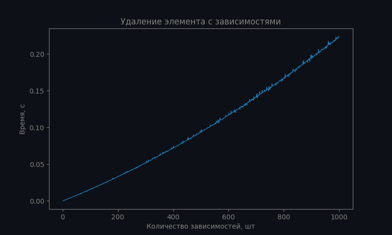

# LLP Lab 1

Модуль осуществляющий хранение (выборку, размещение, гранулярное обновление) данных в одном файле в форме документного
дерева.

## Описание

Для инициализации нового файла для хранения данных нужно вызвать фукнцию:
```c++
int32_t initialize_db(const char *file_name, 
                      std::unordered_map<std::string, data_type> &name_to_type,
                      const std::unordered_map<std::string, std::string> &first_node_data);
```
где `file_name` имя файла, с которым будет производиться работа,
`name_to_type` -- схема данных по которой будут валидироваться документы в формате `map[value_name] = type`
(схему можно задать только один раз для всего документа при инициализации файла),
`first_node_data` -- корневой узел документного дерева в формате `map[value_name] = data`.

Для продолжения работы с уже существующим файлом:
```c++
int32_t initialize_db(const char *file_name);
```

### Модель хранения данных в файле
Модуль осуществляет хранение данных в форме документного дерева в следующем виде:


В файле хранится заголовочная структура в которой содержится информация о корне дерева, о первом освобожденном 
пространстве в файле и схема документного дерева. 

Каждый узел обладает следующими ссылками:
- на родителя
- на первого ребенка
- на предыдущего ребенка родителя
- на следующего ребенка родителя

Таким образом, все дети узла выстраиваются в цепь, ссылку на начало которой мы храним. Это позволяет решить проблему с 
увеличением количества занимаемой памяти родительской структурой при добавлении новых детей, которая возникла б. 
Данное представление графа в сумме с наличием у каждого ребенка ссылки на родителя позволяют производить обход графа
без дополнительной памяти(на запоминание посещенных вершин).

Для решения проблемы фрагментации файла при частом удалении/перезаписывании узлов дерева поддерживается двусвязный
список из освобожденных узлов, ссылка на начало которого хранится в заголовке файла. 
При удалении или перемещении узла из прежнего места мы запоминаем размер освобожденного блока памяти и 
добавляем его в список. Решение довольно простое, однако позволяет удовлетворить предъявленные требования к модулю.

### Структуры для хранения данных и информации о запросе

**Заголовочная структура файла**, хранит в себе ссылку на корень документного дерева, ссылку на двусвязный список 
пустых областей в файле, счетчик количества документов в дереве и схему данных по которой валидируются узлы:
```c++
struct tree_header {
    // Адрес смещения в файле первого узла дерева.
    int64_t first_node;
    // Адрес смещения в файле первого свободного пространства. \n
    // Равняется 0 в случае отсутствия.
    int64_t first_free_space;
    // Количество документов в базе данных, используется для генерации id новых узлов.
    int32_t nodes_count;
    // Занимаемый в памяти размер структуры.
    int64_t size;
    // Схема данных по которой валидируются узлы документного дерева.
    // @details map[value_name] = data_type | id и parent_id -- не являются частью схемы.
    std::unordered_map<std::string, data_type> schema;
};
```

**Структура хранения для узлов дерева** в файле. Помимо хранения данных документа содержит в себе служебную информацию,
обеспечивающую возможность работы с деревом:
```c++
struct node {
    //Смещение от начала документа (адрес) записанного узла.
    int64_t offset;
    // Идентификатор записанного узла.
    int32_t id;
    // Смещение от начала документа (адрес) родителя узла
    int64_t parent;
    // Смещение от начала документа (адрес) предыдущего ребенка родителя текущего узла.
    int64_t prev;
    // Смещение от начала документа (адрес) следующего ребенка родителя текущего узла.
    int64_t next;
    // Смещение от начала документа (адрес) первого ребенка текущего узла.
    int64_t first_child;
    // Реальный размер структуры записанного узла в файле.
    uint64_t size;
    // Размер занимаемой памяти записанного узла в файле.
    // Требуется для устранения утечек памяти в файле, т.к. узел может лежать в свободном пространстве, большем чем ему нужно.
    uint64_t r_size;
    // Все поля узла дерева в соответствии с заданной схемой данных.
    std::unordered_map<std::string, std::string> data;
};
```

Группа структур осуществляющих хранение **информации о запросе** пользователя:
```c++
enum comparison_operator {
    NOP,
    EQUAL,
    NOT_EQUAL
};

struct condition {
    std::string name_value;
    std::string value;
    comparison_operator operation;
};

enum command_type {
    ADD,
    UPDATE,
    FIND,
    DELETE
};

struct query {
    command_type command;
    struct condition condition;
};
```

**Структура** для передачи **результата запрашиваемых данных** пользователю.
Является итератором по документному дереву, поэлементно отдает пользователю данные подходящие под
условие в поле `condirion`.
```c++
struct result_iterator {
    int32_t fd;
    /// Текущее состояние итератора, данные валидны только при наличии соответствующего флага
    struct node node;
    /// Условие, по которому возвращаются данные
    struct condition condition;
    // Флаг валидности данных, на которые указывает итератор, false выставляется если в дереве
    // нет узлов подходящих под заданный condition, либо после попытки сделать proceed уже конечной ноды.
    bool is_valid = true;
};
```

### Детали реализации

Пользователю доступны публичные функции (**интерфейс**) **для взаимодействия** с хранимыми данными:

* **Добавить** новый документ в дерево.
    ```c++
      int32_t add_node(int32_t fd, int32_t parent_id, const std::unordered_map<std::string, std::string> &node_data);
    ```
* **Получить** документ по заданному id.
    ```c++
      std::unordered_map<std::string, std::string> find_node_by_id(int32_t fd, int32_t id);
    ```

* Осуществляет **поиск** в дереве документов **по** заданному **условию**.
    ```c++
      struct result_iterator find(int32_t fd, const struct condition &condition);
    ```
* Возвращает **все узлы** дерева документов.
    ```c++
      struct result_iterator find_all(int32_t fd);
    ```

* **Обновить** поля заданного узла дерева.
    ```c++
      bool update_node(int32_t fd, int32_t id, const std::unordered_map<std::string, std::string> &node_data);
    ```

* Рекурсивно **удалить** заданный узел из дерева.
    ```c++
      bool delete_node(int32_t fd, int32_t id);
    ```

## Сборка и запуск
### Linux
**Требования:**
* CMake 3.23 или новее
* Boost 1.74.0 (COMPONENTS system, filesystem, serialization) или новее
* Компилятор C++ (clang 14 или новее, gcc 11 или новее)
```shell
git clone https://github.com/farid03/llp-database .
cmake -B build && cd build && make
./llp_database
```

### Windows
**Требования:**
* CMake 3.23 или новее
* make
* Boost 1.74.0 (COMPONENTS system, filesystem, serialization) или новее
* GCC 12.2.0 + MinGW-w64 10.0.0
```shell
git clone https://github.com/farid03/llp-database .
md build
cd build
cmake -DCMAKE_BUILD_TYPE=Debug -G "CodeBlocks - MinGW Makefiles" ..
cmake --build .
llp_database.exe
```

## Тесты
### Добавление элемента в дерево

### Обновление элемента по id

### Выборка элемента по id

### Выборка элементов по условию

### Поиск элементов по родителю (по отношению)

### Удаление элемента без зависмостей

### Удаление элемента с зависимостями

### Размер файла от количества элементов


## Прочее

В используемой/требуемой версии boost 1.74.0 имеется [!ошибка](https://github.com/boostorg/serialization/issues/219), 
без исправления которой не удастся скомпилировать проект.